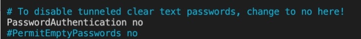
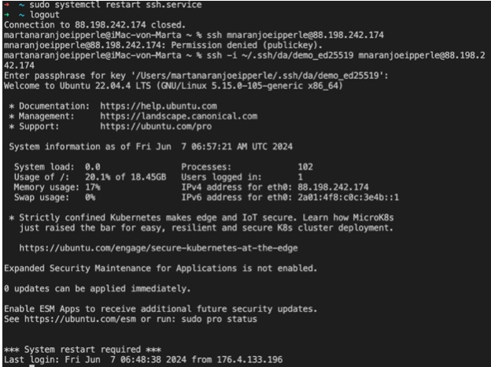
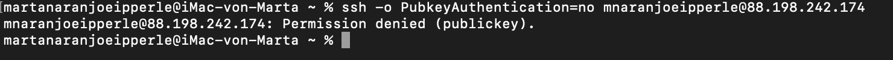
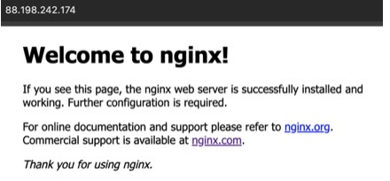
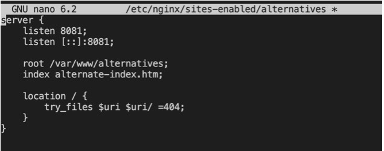
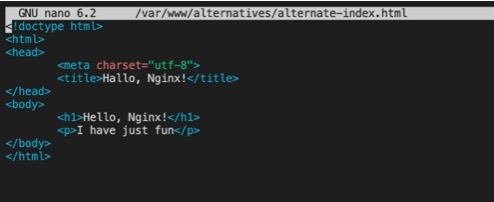
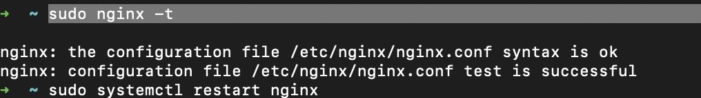
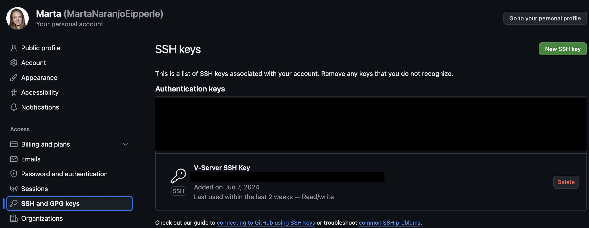

# V-Server Setup

**Name:** Marta Naranjo Eipperle

**Url:** [Link to website](http://88.198.242.174:8081/)

**Link to Challenge:** [Link to Challenge](VServer_Checklist.pdf)

**Description:** Set up a V-Server, generated and deployed SSH keys for secure access, installed and configured nginx, and customized the web server's default page.

---

## Procedure

1. First, a new file named "da" was created on the PC. The following command was entered in the terminal:
    ```bash
    touch ~/.ssh/da
    ```

2. After the file was created, an SSH key pair was generated:
    ```bash
    ssh-keygen -t ed25519
    ```

    - The key was saved under `/Users/martanaranjoeipperle/.ssh/da/demo_ed25519` and a password was set for the key pair. After confirming the password, the following message appeared:
    
        ```
        Your identification has been saved in /Users/martanaranjoeipperle/.ssh/da/demo_ed25519
        Your public key has been saved in /Users/martanaranjoeipperle/.ssh/da/demo_ed25519.pub
        ```

3. Next, the content of the "da" directory was checked.


*Image: Checking the contents of the "da" directory on the local computer.*

4. Using an SSH connection, a login to the server was performed. After successfully logging in, the "demo_ed25519.pub" file was copied to the server using ssh-copy-id:
    ```bash
    ssh-copy-id -i /Users/martanaranjoeipperle/.ssh/da/demo_ed25519.pub mnaranjoeipperle@88.198.242.174
    ```

    - The content of the `.ssh/authorized_keys` file on the server was compared with the content of "demo_ed25519.pub" on the computer and found to be identical. This allowed successful login to the server without needing the server password, only the key password had to be entered.

5. To disable password login, the following command was used:
    ```bash
    sudo nano /etc/ssh/sshd_config
    ```

    

    *Image: Editing the SSH configuration file to disable PasswordAuthentication.*

    - The `PasswordAuthentication` option was changed from "yes" to "no" and the SSH service was restarted with:
    ```bash
    sudo systemctl restart ssh.service
    ```

    

    *Image: Restarting the SSH service after making configuration changes.*

6. After logging out, an attempt was made to log in to the server using a password, which failed as expected. Now, only key-based login is possible. This was confirmed with the following command:
    ```bash
    ssh -o PubkeyAuthentication=no mnaranjoeipperle@88.198.242.174
    ```
    - Everything appears to be functioning as desired.

    

    *Image: Permission denied error encountered while attempting to access a restricted file.*

7. Next, Nginx was installed:
    ```bash
    sudo apt update
    sudo apt install nginx -y
    ```

8. The status was checked with:
    ```bash
    systemctl status nginx.service
    ```

    

    *Image: Checking status after installing and configuring Nginx.*

9. To access the web server, the IP address of the server can be entered in a browser.
    
    

    *Image: Accessing the web server by entering the server's IP address into a web browser.*

10. To replace the "Welcome to nginx" page with a custom page, a new directory was created:
    ```bash
    sudo mkdir /var/www/alternatives
    ```
    - An HTML file was created in this directory:
    ```bash
    sudo touch /var/www/alternatives/alternate-index.html
    ```
    - The content was then edited:
    ```bash
    sudo nano /etc/nginx/sites-enabled/alternatives
    ```

    

    *Image: Editing the configuration file for the alternative website in Nginx.*
    
    ```bash
    sudo nano /var/www/alternatives/alternate-index.html
    ```

    

    *Image: Content of the alternative index page in Nginx after editing.*

11. To redirect traffic from port 80 to 8081, the following steps were performed:

    - Open the NGINX configuration file:
    ```bash
    sudo nano /etc/nginx/nginx.conf
    ```

    - Add the server redirection configuration.
     ```nginx
    server {
        listen 80;
        server_name 88.198.242.174;

        location / {
           return 301 http://88.198.242.174:8081$request_uri;
        }
    }

    server {
        listen 8081;
        server_name 88.198.242.174;

        location / {
            root /var/www/alternatives ;
            index alternate-index.html;
            }
    }
    ```

    - Save the changes in nano by pressing `CTRL + O`, then `ENTER`, and exit the editor with `CTRL + X`.

    - Test the NGINX configuration and restart the service:
    ```bash
    sudo nginx -t
    sudo systemctl restart nginx
    ```

    

    *Image: Result of testing the NGINX configuration for syntax errors.*


12. Now, when loading "http://88.198.242.174:8081/" in the browser, the change is visible.

    

    *Image: Updated website view after restarting Nginx, visible at "http://88.198.242.174:8081/".*

13. After this process, Git was configured on my V-server:
    ```bash
    git config --global user.name "Marta"
    git config --global user.email "plachecinska@web.de"
    ```

    - Then, I checked the information with:
    ```bash
    git config --list
    ```
    
    - Configured ssh-keygen on the server,
    
    - Extracted the content with:
    ```bash
    cat ~ /home/mnaranjoeipperle/.ssh/id_rsa.pub
    ```
    
    - And finally deposited it on GitHub.

    

    *Image: Screenshot from GitHub.*
